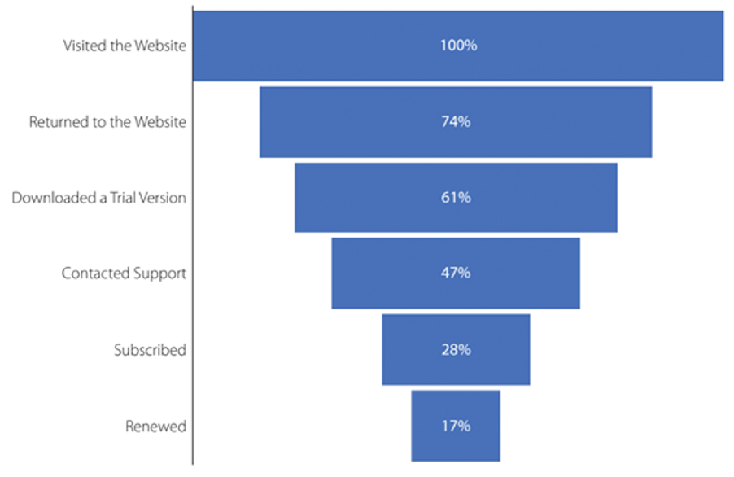

# CSC 402

## **Storytelling and Analytics: Transforming Data into Insightful Narratives**

# Week 1

# **Part 1: The Foundations of Data Storytelling**

- **1.1 Course Overview and Objectives**
    - **1.1.1 Syllabus Overview**
      
        This course, *Storytelling and Analytics*, is designed to equip students with the tools and methodologies to transform raw data into meaningful stories. These stories drive better decisions, inspire action, and present data-driven insights in an engaging way.
        
        **Key Details:**
        
        •	**Schedule:** Tuesdays, 5:30–7:59 PM EST (Instructor in CST).
        
        •	**Block Dates:** January 13 – March 2.
        
        •	**Instructor Contact:**
        
        •	**Email:** trevor.m.tomesh@willmw.edu (primary communication channel).
        
        •	**Canvas Messaging:** Secondary method but not preferred.
        
        **Office Hours:**
        
        •	Tuesdays, 3:30–5:30 PM EST. Appointments outside these hours are available upon request.
        
        **Course Textbook:**
        
        Kirk, A. (2016). *Data Visualization: Exploring and Explaining with Data* (Cengage). The textbook is essential for mastering data visualization techniques and understanding the role of narrative in data interpretation.
        
        ---
    
- **1.2 Storytelling: The Universal Language**
    - **1.2.1 Why Stories Resonate**
      
        Storytelling is intrinsic to human experience, crossing cultural, temporal, and technological boundaries. People naturally relate to stories because they provide structure, emotional engagement, and a sense of purpose. From ancient myths to modern cinema, stories drive our understanding of the world.
        
        In analytics, storytelling:
        
        •	**Motivates:** Captures attention by creating relatable scenarios.
        
        •	**Illuminates:** Highlights insights while addressing gaps or missing data.
        
        •	**Inspires Action:** Encourages stakeholders to make informed decisions.
        
        **The Importance of Structure in Stories:**
        
        Think about your favorite activities—reading books, watching movies, or even playing video games. All of these mediums use stories to guide your experience and emotions. Similarly, in analytics, data-driven stories can evoke powerful responses by making complex data accessible and actionable.
    
- **1.3 Data Storytelling in Action: Case Studies**
    - **1.3.1 Case Study 1: Abraham Wald and Aircraft Survivability (WWII)**
      
        During World War II, the Allied forces faced the challenge of deciding where to reinforce armor on their aircraft. They collected data on bullet holes in planes that returned from missions, identifying common areas of damage, such as the wings and fuselage.
        
        
        
        **Initial Assumption:**
        
        Reinforce the areas with the most bullet holes to protect aircraft from damage.
        
        **Abraham Wald’s Insight:**
        
        Wald recognized survivorship bias in the data. The planes returning were hit in areas that allowed them to survive. The absent data—planes that did not return—revealed that hits in other areas (engines, cockpits) were critical to the planes’ survival.
        
        **Action Taken:**
        
        Armor was applied to areas with no bullet holes, significantly improving aircraft survivability.
        
        **Lesson:** Stories, when supported by data, can challenge assumptions and lead to better outcomes (citation needed).
        
    - **1.3.2 Case Study 2: Falling Cats and Survivorship Bias**
      
        A veterinary study analyzed data on cats falling from various heights. The study found that cats falling from heights of six stories or less were frequently injured, while fewer injuries were reported for falls from greater heights.
        
        **Misinterpretation:**
        
        It was initially believed that higher falls gave cats more time to right themselves and land safely.
        
        
        
        **Reality:**
        
        Dead cats were not brought to veterinarians, skewing the data. Higher falls were often fatal, but this data was excluded.
        
        **Lesson:** Data collection must consider what is missing, as excluding critical information leads to flawed conclusions (citation needed).
        
    - 1.3.3 Case Study 2: Recycling
      
        
        
        **Summary of Recycling Example**
        
        The recycling example highlighted the inefficiencies of plastic recycling systems, using a clear visualization to demonstrate the disparity between public perception and reality.
        
        **Key Data Points:**
        
        •	**83 billion tons** of plastic have been produced globally.
        
        •	**70%** of plastics are single-use and discarded after one use.
        
        •	Of all plastics produced, **only 6%** are recycled.
        
        •	Even among recycled plastics, **1% or less** are reused effectively.
        
        •	**55%** of plastics are discarded outright (e.g., in landfills or oceans).
        
        **Key Insight:**
        
        The graph starkly illustrated that despite efforts to promote recycling, the vast majority of plastic waste ends up in landfills or is incinerated. This disconnect between the idealized vision of recycling and its real-world outcomes emphasizes systemic inefficiencies.
        
        **Purpose of the Example:**
        
        The recycling example demonstrated how data visualization can:
        
        1.	Clarify complex systems for audiences.
        
        2.	Challenge common assumptions (e.g., “recycling solves plastic waste”).
        
        3.	Highlight actionable areas for improvement, such as reducing single-use plastics or improving recycling technologies.
        
        **Takeaway:**
        
        This example emphasized how effective visualizations not only reveal problems but also help frame them in ways that can inspire informed actions and policy changes.
        
    - 1.3.4 Case Study 3: Global Warming
      
        **Summary of NASA’s Data Zooming Example**
        
        In the lecture, the example of NASA’s global temperature anomaly graph was used to illustrate how the presentation of data can be shaped to tell a specific story.
        
        NASA’s graph displayed global temperature changes from 1880 to 2020, showing a sharp rise in temperatures. This visualization was effective in drawing attention to recent warming trends, aided by design choices like a blinking red light to emphasize the increase.
        
        
        
        
        
        
        
        **Key Insight:**
        
        NASA focused on a relatively narrow timeline, starting in 1880, despite having access to much longer climate records going back hundreds of thousands of years. If the broader timeline were presented (e.g., a chart spanning 800,000 years), viewers would observe natural temperature fluctuations and longer-term trends. This might lead to questions about the immediacy or uniqueness of the current warming trend.
        
        **Purpose of the Zooming:**
        
        NASA’s decision to “zoom in” on the recent data:
        
        •	**Supports the Narrative:** Highlights human-driven (anthropogenic) changes since the Industrial Revolution.
        
        •	**Simplifies the Story:** Makes the message clearer and more urgent for general audiences.
        
        **Implication:**
        
        While narrowing the focus can make data more compelling, it may also omit context that could provide a fuller picture. This approach underscores the dual power and responsibility of data visualization in shaping narratives.
    
- **1.4 The Three Pillars of Analytics**
  
    Analytics is the backbone of modern decision-making. It uses descriptive, predictive, and prescriptive methods to extract actionable insights from data.
    
    - **1.4.1 Descriptive Analytics: Understanding the Past**
      
        **Definition:** Summarizes historical data to provide insights into past events.
        
        **Applications:**
        
        •	Tracking sales performance.
        
        •	Summarizing election polling results.
        
        **Tools:** Dashboards, reports, and statistical summaries.
        
    - **1.4.2 Predictive Analytics: Forecasting the Future**
      
        **Definition:** Uses historical data to identify trends and forecast future outcomes.
        
        **Applications:**
        
        •	Predicting market trends.
        
        •	Anticipating customer behavior.
        
        **Tools:** Regression analysis, time-series modeling, machine learning.
        
        **Example:**
        
        NASA’s global temperature records from 1880 to 2020 reveal a steady increase in temperature anomalies. Using predictive analytics, scientists forecast continued warming trends, driving awareness and action on climate change.
        
        
        
    - **1.4.3 Prescriptive Analytics: Guiding Decisions**
      
        **Definition:** Recommends actions based on insights derived from descriptive and predictive analytics.
        
        **Applications:**
        
        •	Optimizing inventory management.
        
        •	Formulating marketing strategies.
        
        **Integrated Example:**
        
        A retailer examines historical sales (descriptive), forecasts demand during peak seasons (predictive), and adjusts inventory accordingly (prescriptive).
        

# **Part 2: Big Data in the Modern Era**

- **2.1 The Four Vs of Big Data**
  
    Big Data is defined by four primary characteristics:
    
    1.	**Volume:** Sheer quantity of data generated daily.
    
    2.	**Velocity:** Speed at which data is created and processed.
    
    3.	**Variety:** Diversity in data formats (e.g., text, images, audio).
    
    4.	**Veracity:** Reliability and quality of the data.
    
    **Example:** A fitness tracker collects data on heart rate, movement, and sleep patterns. This diverse, high-velocity data is aggregated into actionable insights for users (citation needed).
    
- **2.2 Data Visualization: The Key to Storytelling**
  
    **The Funnel Chart:**
    
    A funnel chart visualizes the customer conversion process, showing where users drop off. For example, a software company may find that while 74% of visitors download a trial version, only 28% subscribe, revealing a need to improve the user experience during trials.
    
    
    
    **Time-Series Graphs:**
    
    Time-series graphs track changes over time, such as rising global temperatures. These graphs not only describe past trends but also help predict future outcomes.
    
- **2.3 Applying the Hero’s Journey in Analytics**
  
    Joseph Campbell’s Hero’s Journey (1949) offers a storytelling framework that parallels data storytelling:
    
    1.	**Call to Adventure:** Present the problem (e.g., declining customer retention).
    
    2.	**Crossing the Threshold:** Dive into data insights and suggest actions.
    
    3.	**Trials and Tribulations:** Implement strategies to test and refine solutions.
    
    4.	**Return with the Elixir:** Present results and actionable recommendations.
    
    **Example:**
    
    A software company uses data visualization to identify drop-offs between trial users and subscribers. By refining support interactions, the company increases conversion rates and creates a loyal customer base.
    
- **2.4 Conclusion and Future Exploration**
  
    Storytelling is the bridge between raw data and meaningful insights. By combining descriptive, predictive, and prescriptive analytics with compelling visualizations, analysts can drive better decisions and inspire action. In the next chapter, we’ll explore advanced visualization techniques using Excel and other tools.
    

---

- **References**
  
    •	Campbell, J. (1949). *The Hero with a Thousand Faces*. Princeton University Press.
    
    •	NASA Climate Change. (2020). Global temperature anomalies. Retrieved from nasa.gov.